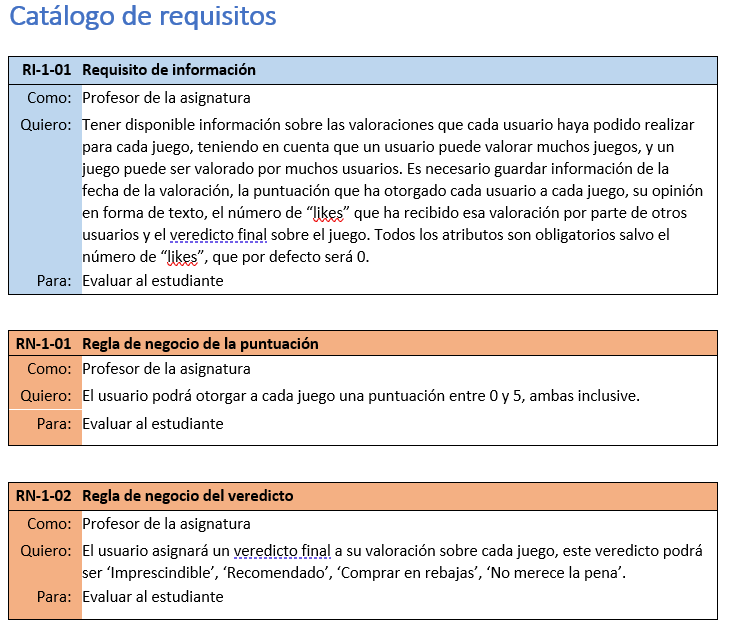
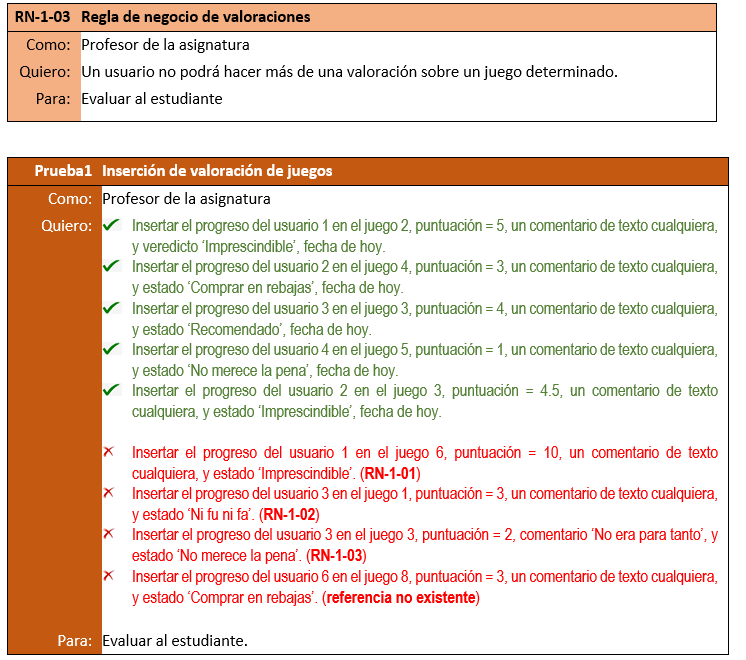

## EJERCICIO 1
Implemente los requisitos proporcionados (RI/RN).
(La tabla puntúa 1 y cada restricción 0,5)

```sql
CREATE TABLE valoraciones(
id INT PRIMARY KEY AUTO_INCREMENT NOT NULL,
jugadorId INT NOT NULL,
videojuegoId INT NOT NULL,
fechaValoracion DATE NOT NULL,
puntuacion INT NOT NULL CHECK(puntuacion >= 0 AND puntuacion <= 5),
opinion TEXT NOT NULL,
numLikes INT DEFAULT 0,
veredictoFinal ENUM('Imprescindible','Recomendado','Comprar en reabajas','No merece la pena') NOT NULL,
UNIQUE(jugadorId, videojuegoId),
FOREIGN KEY (jugadorId) REFERENCES jugadores(jugadorId)
	ON DELETE CASCADE
	ON UPDATE CASCADE,
FOREIGN KEY (videojuegoId) REFERENCES videojuegos(videojuegoId)
	ON DELETE CASCADE
	ON UPDATE CASCADE
);
```

## EJERCICIO 2
Codifique un procedimiento almacenado que inserte una nueva valoración de un usuario concreto para un juego dado en la tabla creada en el ejercicio anterior, que será llamado tantas veces como progresos se deseen añadir.
Para comprobar las RN y las restricciones de Integridad, se llamará al procedimiento con los parámetros que aparecen en Prueba1-Inserción de valoración de juegos. Las valoraciones en verde se insertarán y las marcadas en rojo serán rechazadas.
 (Si la inserción se realizar directamente con varios comandos INSERT de SQL, entonces se puntúa 0,5)

 ```sql
DELIMITER //

CREATE OR REPLACE PROCEDURE insertar(jugadorId INT, videojuegoId INT,
puntuacion INT, opinion TEXT,veredictoFinal VARCHAR(255),fechaValoracion DATE)

BEGIN

INSERT INTO valoraciones(jugadorId, videojuegoId, puntuacion, opinion,veredictoFinal, fechaValoracion) 
VALUES (jugadorId, videojuegoId, puntuacion, opinion,veredictoFinal, fechaValoracion);

END //

DELIMITER ;

CALL insertar(1,1,2,'Ta bien', 'Recomendado', CURDATE());
```

## EJERCICIO 3
Cree una consulta que devuelva todos los usuarios, sus juegos y las valoraciones respectivas, ordenados por videojuegosId.
```sql
SELECT jugadores.nickname, videojuegos.nombre, valoraciones.* FROM valoraciones
JOIN jugadores ON valoraciones.jugadorId = jugadores.jugadorId
JOIN videojuegos ON videojuegos.videojuegoId = valoraciones.videojuegoId
GROUP BY jugadores.nickname
ORDER BY videojuegos.videojuegoId;
```
## EJERCICIO 4
Codifique un trigger para impedir que la fecha de una valoración sea anterior a la fecha de lanzamiento del juego, y posterior a la fecha actual. Añada una instrucción que haga saltar el trigger.

```sql
DELIMITER //
CREATE TRIGGER ejercicio4
BEFORE INSERT ON valoraciones
FOR EACH ROW
BEGIN

DECLARE fechaLanzamiento DATE;


SELECT videojuegos.fechaLanzamiento into fechaLanzamiento FROM videojuegos
WHERE videojuegos.videojuegoId = NEW.videojuegoId;
    
    IF NEW.fechaValoracion > CURDATE() OR NEW.fechaValoracion < fechaLanzamiento THEN
        SIGNAL SQLSTATE '45000'
        SET MESSAGE_TEXT = 'ERROR';
    END IF;
END //

DELIMITER ;
```
## EJERCICIO 5
Codifique una función que devuelva el número de valoraciones de un usuario dado.
Realice una prueba de la función con UsuarioId=2.

```sql
DELIMITER //
 CREATE OR REPLACE FUNCTION ejercicio5(usuarioId INT) RETURNS DOUBLE
 BEGIN
  RETURN (
    SELECT COUNT(valoraciones.id) FROM valoraciones
    WHERE valoraciones.jugadorId = usuarioId
  );
 END //
 DELIMITER ;
 
SELECT ejercicio5(1);
```
## EJERCICIO 6
Cree una consulta que devuelva los juegos y la media de las valoraciones recibidas, ordenados de mayor a menor. En el listado deben aparecer todos los juegos, tengan o no valoración.

```sql
SELECT videojuegos.nombre, AVG(valoraciones.puntuacion) AS mediaPuntuacion FROM valoraciones
JOIN videojuegos ON valoraciones.videojuegoId = videojuegos.videojuegoId
GROUP BY videojuegos.nombre
ORDER BY mediaPuntuacion DESC;
```

## EJERCICIO 7
Cree un trigger que impida valorar un juego que esté en fase ’Beta’.
```sql
DELIMITER //
CREATE TRIGGER ejercicio7
BEFORE INSERT ON valoraciones
FOR EACH ROW
BEGIN

DECLARE estado DATE;


SELECT videojuegos.estado INTO estado FROM videojuegos
WHERE videojuegos.videojuegoId = NEW.videojuegoId;
    
    IF estado = 'Beta' THEN
        SIGNAL SQLSTATE '45000'
        SET MESSAGE_TEXT = 'No se puede valorar un juego en fase Beta';
    END IF;
END //

DELIMITER ;
```

## EJERCICIO 8
Cree un procedimiento pAddUsuarioValoracion que, dentro de una transacción, inserte un usuario y una valoración de dicho usuario a un videojuego dado. Incluya los parámetros que considere oportunos.
Realice dos llamadas: una que inserte ambos (el usuario y la valoración) correctamente, y una en la que el segundo rompa alguna restricción y aborte la transacción. Incluya capturas de pantallas.

```sql
DELIMITER //
CREATE OR REPLACE PROCEDURE pAddUsuarioValoracion(
nickname VARCHAR(255),
valoracionId INT ,
jugadorId INT ,
videojuegoId INT ,
fechaValoracion DATE ,
puntuacion INT ,
opinion TEXT ,
numLikes INT,
veredictoFinal VARCHAR(255)
) 

BEGIN 

-- manejo errores
DECLARE exit handler FOR SQLEXCEPTION 
BEGIN
	ROLLBACK;
	SIGNAL SQLSTATE '45000' SET MESSAGE_TEXT = 'ERROR';
END ;

START TRANSACTION ;

INSERT INTO jugadores(jugadorId, nickname)
VALUES(jugadorId, nickname);

INSERT INTO valoraciones(valoracionId, jugadorId, videojuegoId, fechaValoracion,
puntuacion, opinion, numLikes, veredictoFinal)
VALUES(valoracionId, jugadorId, videojuegoId, fechaValoracion,
puntuacion, opinion, numLikes, veredictoFinal);


COMMIT ;

END //

DELIMITER ;
```
